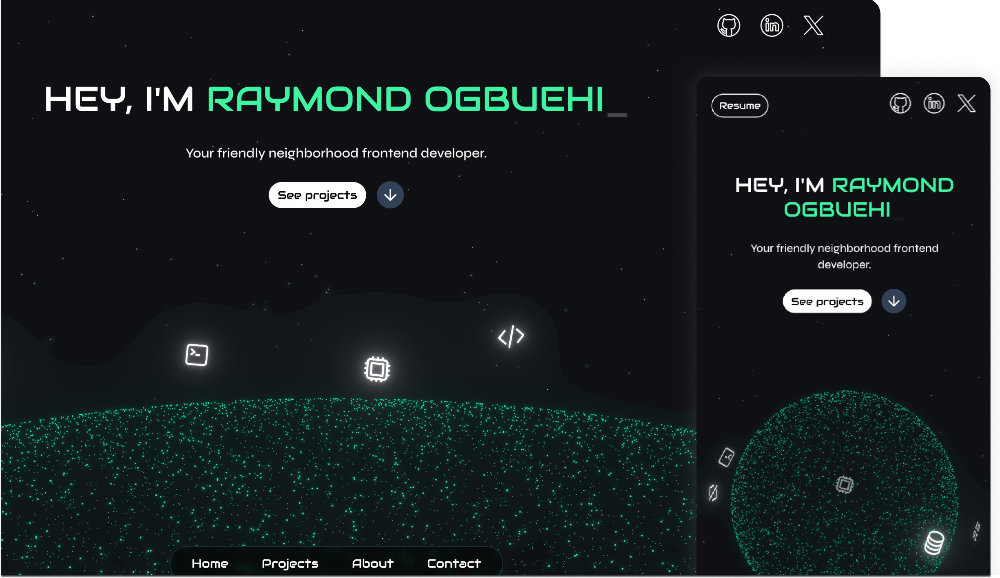

# My Portfolio Website 🚀

 

## Description
I wanted something really unique for my personal website. It took a long time to figure out the final design because I don’t have much design training, so there was a LOT of trial and error. I’m pretty happy with the result though. If you decide to use my designs without any significant changes, don’t forget to attribute me; don’t be mean. Enjoy!

## Tech Stack
- TypeScript
- Next.js
- Tailwind CSS
- Motion (Framer Motion)
- GSAP 
- Three.js
- Formspree

## Run Locally

- `git clone https://github.com/Ihezie/my-portfolio`
- `cd my-portfolio`
- `pnpm install`
- `pnpm dev`

